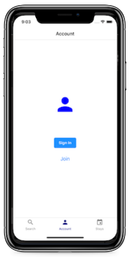
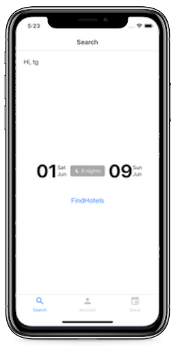
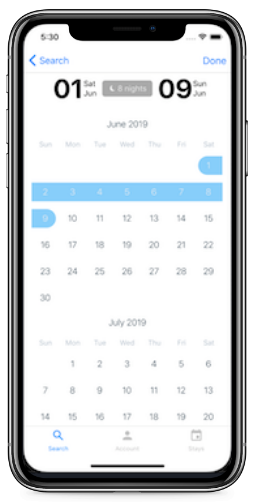
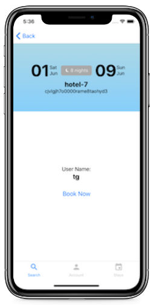
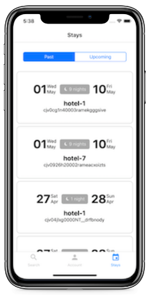

React Native reservation app using ES6 and pure components.

### Install

```
yarn
react-native link
react-native run-ios
```

# Features:

- Code organization (even though this is two features, organize the files as if it were a larger enterprise application)
- Style organization
- Data/Graph Organization
- Component Organization
- Folder Structure
- Type checking
- A clean method for managing local state with GraphQL queries
- Unit test methodology/readability
- Code readability (i.e. ability for future developers to pick up where you left off)


### Account

Uses local state management in `Apollo Client` to keep track of users for creating reservations and getting reservations.  



### Search Hotel and Create Reservation

Uses separate screens to select dates, select hotels, and book reservations.  
`react-native-calendars` was used for the calendar screen.  





### View Reservations

View the current user's reservations by selecting the `stays` tab.  
`react-native-swipeout` was used show a delete button on each item.  



# Tech Stack

Utilizes the following technology stack:
React-Native
Apollo-Client
Jest/Enzyme
Typescript

# Dev Tools

Eslint-Husky-Prettier
ApolloDevTools
React SketchApp
Storybook

# Back End

Apollo Client uses the following queries and mutations: 
queries: reservations
mutations: createReservation, deleteReservation

# Local state managment

Apollo Client manages local state of the `recentSearch`, `user`, and `userList` with GraphQL queries and mutations.

Local state is split into different files for easier organization.


